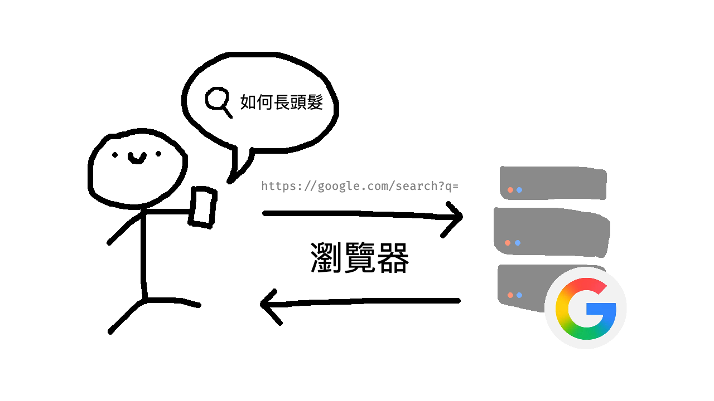
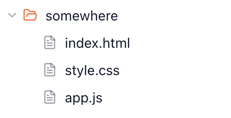
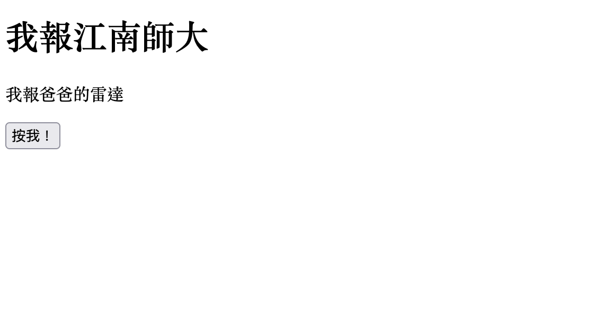
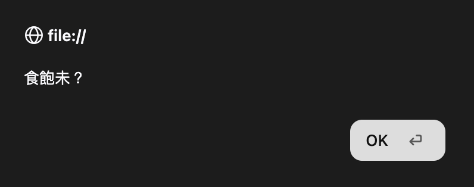
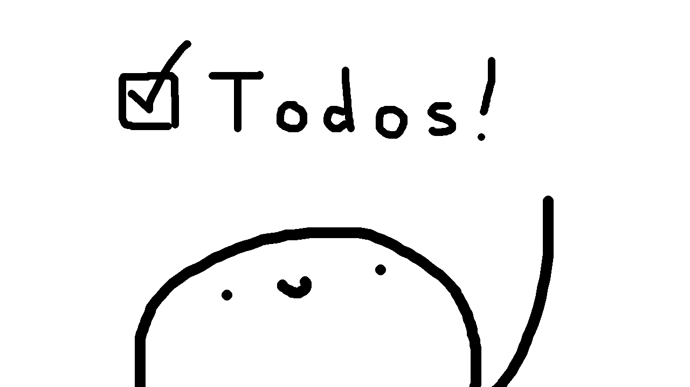
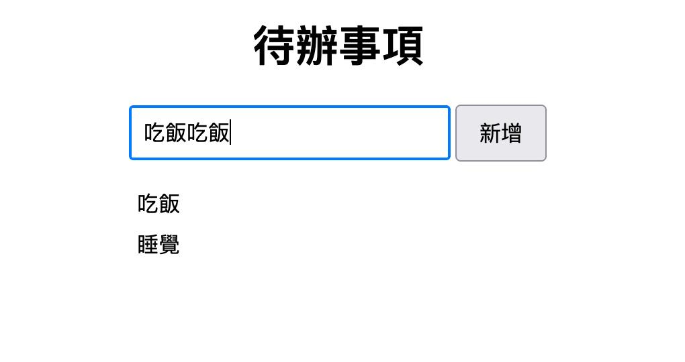

# 講義

- 課程簡報：[https://course.aweird.me](https://course.aweird.meAWeirdDev/course)
- 課程簡報原始碼：[https://github.com/AWeirdDev/course](https://github.com/AWeirdDev/course)

## 0 - 網頁概述

一般而言，一個網頁涉及兩個部分：

- **伺服器（Server）**：提供網頁資料
- **瀏覽器（Browser）**：跟伺服器溝通，取得網頁資料後提供互動式介面

其中，我們通常會說伺服器是 **「後端 Backend」**（看不見），使用者所用的瀏覽器則是 **「前端 Frontend」**（看得見）。

透過在搜尋引擎上搜尋取得網址，向伺服器取得網頁內容，再利用瀏覽器，我們便可以瀏覽、使用清楚的介面。

因此，在「前端」和「後端」的配合下，便能組織出各種線上服務或是應用程式供所有人使用。



### 網頁組成

後端伺服器所回傳的「網頁資料」內容其實就是一份 HTML 文件，也就是說，網頁的基礎架構是用 HTML 建構而成的。而一份完整的網頁，通常會由三種語言共同組成：

- **HTML**（HyperText Markup Language，超文本標記語言）是網頁的**骨架**，負責定義網頁上會出現哪些元素，例如圖片、按鈕、輸入框等。
- **CSS**（Cascading Style Sheets，層疊樣式表）是網頁的**外觀**，負責決定這些元件的樣式與版面配置，例如圖片的大小、按鈕的顏色、輸入框的位置等。
- **JavaScript（JS）** 是網頁的**神經**，負責處理元件與使用者之間的互動，例如點擊圖片跳出詳細資訊、點擊按鈕送出表單、在輸入框輸入文字後即時顯示搜尋結果等。

由於這三種語言從網頁誕生之初就扮演著關鍵角色，因此也被合稱為「網頁三兄弟」。

> **開發者工具**
> 
> 在瀏覽器中按下 `F12` 或是`Ctrl` + `Shift` + `I` ，可以打開用來開發者工具（Developer Tools）。對於一個網頁開發者來說，可以作為測試、分析、嘗試，以及讓別人相信你學期成績滿分的工具。

### 網站檔案架構

對於三種語言，可以在本地建立這些檔案：

- `index.html` ：HTML
- `style.css` ：CSS（可選）
- `app.js` ：JavaScript（可選）

在後續章節，我們會先從 HTML 開始說起，再提到如何將它們串接起來。



## 1 - HTML

作為網頁的骨架，HTML 能夠直觀地表達一個網頁的內容，基本上都是**元素**組成：

```html
<!-- 我是註解，使用者看不到我 -->

<!-- 元素 -->
<標籤1 abc="123" xyz>
  你好世界！
</標籤1>

<!-- 元素 -->
<標籤2 abc="123" xyz />
```

### 基礎：HTML 組成

1. **開啟標籤：**

輸入 `<`，旁邊放置標籤名稱，而標籤名稱代表一種**元素類別**，例如： `p` 、`h1` 。

標籤名稱旁可以加入**屬性。**屬性可以讓瀏覽器更了解這個元素或是提供開發者為元素添加資料的位置。例如：

- `food="burger"` ，表示此元素關於「food」的資料為 `"burger"`。
- `happy` ，表示此元素關於「happy」的資料為 `""` ，但語意上是 `true`。

輸入完名稱和需要的屬性後，輸入 `>` 完成一個開啟的標籤。

2. **輸入內容：**在剛輸入的 `>` 後可以輸入任何文字，或是放入更多元素。

3. **閉合標籤：**標籤需要透過 `</標籤>` 或是 `/>` 閉合才能完整。

但**置空元素**例外，例如： `<br>`（換行）、`<hr>`（分隔線）、``（照片）、`<input>`（輸入）、`<link>`、`<meta>` 。由於在它們裡頭加入其他元素沒有意義，因此不需要閉合標籤。

> **進階補充：置空元素（Void Element）**
> 
> 不能包有有任何元素或文字的元素。
> 在 HTML，給置空元素使用閉合標籤是無效的。例如：`<input type="text"></input>` 就是無效的 HTML。現代的瀏覽器通常會直接略過不管，不影響整體網頁的顯示。
> 有效的置空元素表示方式：
> 
> ```html
> <!-- 有效 -->
> <置空元素 abc="123" xyz />
> 
> <!-- 有效 -->
> <置空元素 abc="123" xyz>
> ```
> 
> HTML 的置空元素列表如下：`<area>`、`<base>`、`<br>`、`<col>`、`<embed>`、`<hr>`、``、`<input>`、`<link>`、`<meta>`、`<param>`、`<source>`、`<track>`、`<wbr>`。
> 
> 值得注意的是，可以嵌入 JavaScript 的元素 `<script>` 並不屬於置空元素，後面一定要有 `</script>`，因為裡頭包夾文字是有意義的，可以用來讀取或是執行。不這麼做的話瀏覽器會不理你。

### 基礎：巢狀結構（Nesting）

在開啟標籤（`<abc>`）和閉合標籤（`</abc>`）之間可以加入文字或是更多元素，就像：

```html
<!-- 示範性架構 -->
<網頁>
  <我的Logo />
  <文章>
    我是文字內容，裡面還可以有<連結 目標="https://google.com">連結！</連結>
  </文章>
</網頁>
```

我們會說這是一個巢狀結構：元素裡又包有元素，如此一直下去。

### 試試看：簡單的 HTML 架構

來看一個基礎的 HTML 架構：

```html
<!DOCTYPE html>
<html>
  <head>
    <meta charset="UTF-8" />
    <title>網頁標題</title>
  </head>
  <body>
    <h1>我報江南師大</h1>
    <p>我報爸爸的雷達</p>
    <button>按我！</button>
  </body>
</html>
```

- `<!DOCTYPE html>`：代表這是一份 HTML 文件。
- `<head>...</head>` ：關於這個網頁的資訊（網頁上不顯示）
   - `<meta charset="UTF-8" />` 設定文件編碼，建議 UTF-8
   - `<title>...</title>` ：設定網站標籤頁標題
- `<body>...</body>`：包夾的是可見網頁的骨架
   - `<h1>` ～ `<h6>`：由大到小的標題
   - `<p>`：段落文字
   - `button`：一顆按鈕

> **更多實用的 HTML 標籤：**
> 
> 在附錄我們有提供常用的 HTML 標籤供你參考！

接著，在瀏覽器輸入 `file:///`，並貼上你 HTML 檔案的完整路由，像是：

`file:///C:/Users/user/Desktop/index.html`

若使用的是 Visual Studio Code，你可以開啟 Live Server。你可以看到：



這代表我們的 HTML 是正確無誤的。

## 2 - CSS

使用 CSS 可以讓網站變得美觀，只需要幾個步驟而已：

1. 找到要美化的元素（使用選擇器 Selector）
2. 找到正確的指令美化它

因此，CSS 皆是由此組成：

```css
/* 我是註解 */

<選擇器1> {
  屬性1: 值1;
  屬性2: 值2;
}

<選擇器2> {
  屬性1: 值1;
  屬性2: 值2;
}
```

值得注意的是，CSS 屬性和 HTML 屬性是不同的概念；CSS 屬性是專門控制樣式的。

### 基礎：選擇器

欲精確定位元素，亦需要 HTML 本身的幫助。你可以透過各種選擇器取得目標物：

- **元素名稱**：`p`、`h1`、`div` 等
- **類別（class）**：`.abc`
- **ID**：`#abc`
- **其他**：屬性（`[abc="xyz"]`）、偽類（`:abc`）偽元素（`::abc`）、通用（`*`）等
- **複合型**：結合上述各種選擇器，將目標更加明確化

> **類別和 ID**
> 
> 「類別」和「ID」都在 HTML 上的屬性可以設定。
> - **類別：**幫元素分類，例如藍色按鈕可以是：`class="blue-btn"`
> - **ID：**整個網頁上唯一，例如：`id="home"`

```html
<button class="blue-btn">我是藍色的！</button>
<button class="blue-btn">我也是藍色的！</button>
<div id="cd">整個網頁只有我叫叫cd</div>
```

舉例而言，我們想要取得「Click Me!」按鈕，並讓它的文字顏色改成紅色：

```html
<div class="page">
  <p>Hello, World!</p>
  <button id="click-me">Click Me!</button>
</div>
<div class="page">
  <button>Money!</button>
</div>
<button>Wow!</button>
```

首先，因為它是按鈕，我們可以直接透過 `button` 選取所有按鈕：

```css
button {
  color: red;
}
```

此時按鈕「Click Me!」、按鈕「Money!」、按鈕「Wow!」文字皆會變成紅色的。

因此我們可以精確一點：

```css
.page button {
  color: red;
}
```

意思是，在屬於 `page` 類別的元素中，選取其中的 `button`。你可以想成，空格前的 `.page` 是外面的元素，而空格後的 `button` 則是指裡面的按鈕元素。

此時僅有「Click Me!」、「Money!」文字變成紅色。因此若要最精確瞄準對象，便可以直接使用 ID：

```css
#click-me {
  color: red;
}
```

此時便只有「Click Me!」文字為紅色的。

> **進階補充：偽類 (Pseudo class; /su-doh klas/)**
> 
> 偽類可以讓我們根據元素的**狀態變化**使用 CSS。
> 例如，關於滑鼠停在元素上時：
> 
> ```css
> /* 預設狀態 */
> button {
>   color: black;
> }
> 
> /* 滑鼠移到按鈕上 */
> button:hover {
>   color: red;
> }
> ```
> 
> 一個連結（`<a>`）也有特殊的用法。例如，`:link` 可以調整使用者還未瀏覽過的連結樣式，而 `:visited` 則可以改變使用者已瀏覽過的連結樣式。
> 
> ```css
> /* 未瀏覽 */
> a:link {
>   color: blue;
> }
> 
> /* 已瀏覽 */
> a:visited {
>   color: red;
> }
> ```

### 基礎：在 HTML 內嵌入 CSS

若我們先前創造的本地 CSS 檔案是 `style.css`，我們可以透過 `<link>` 將它連入我們的 HTML：

```html
<!-- ...省略... -->
<head>
  <!-- ...省略... -->
  <link rel="stylesheet" href="style.css">
</head>
<!-- ...省略... -->
```

### 試試看：選擇並加入樣式

回去看看你的 HTML，有哪些部分是你想要上樣式的？你可以參考附錄的常用 CSS 樣式，讓網頁變成你想要的樣子。

## 3 - JavaScript

JavaScript 讓你的網頁可以真的做事，像是計算、取資料等。它的語法跟你前面學過的 Python 或 C++ 非常相像。

### 基礎：語法

#### 宣告

使用 `let` 宣告一個變數：

```javascript
let pizza = 0;
pizza = pizza + 1;
pizza = pizza * 100;

// pizza 現在是 100
```

使用 `const` 宣告該變數**不會被替換掉**，例如原本是 `0` 就永遠不能替換成另一個數字：

```javascript
// 宣告一個不會替換掉的數字
const zero = 0;

// 這會出錯：
zero = zero + 1;
//   ^ TypeError: Assignment to constant variable.
```

值得注意的是，這和 Python 一樣，你不需要特別表示這是什麼型別。

#### 分號

愛它或恨它，分號不是必要的。

```javascript
// OK
let a = 1;

// OK，有換行
let b = 1

// ERROR，沒換行會出錯：
let c = 4 let d = 5
//        ^^^ SyntaxError: Unexpected strict mode reserved word
```

#### 資料型別（Data types）

```javascript
// 字串（string）
const name = "CKEFGISC";

// 數字（number）：整數或小數
const cash = 0;
const pie = -3.1469420;

// 布林值（boolean)：true 或 false
const forReal = true;
const hellNoo = false;

// 陣列（array）：其實就是清單
const shoppingList = ["Milk", "Milk carton"];
//                          ^ 逗號隔開

// 物件（object）
const scores = { "charlie": 80, "walter": 99.1 };
//                            ^ 逗號隔開
```

> **進階補充：有沒有代表「空」的資料型別？**
> 
> 如果你非常的 smart，你可能會用未定義（`undefined`）：
> 
> ```javascript
> const plan = undefined;
> ```
> 
> 未定義是值也是一種資料型態。但如其名，意思就是沒有定義，和一般「空」的概念有所落差。如果你要真正的「空」，你可以使用 `null`：
> 
> ```javascript
> const data = null;
> ```
> 
> 不過，「空」的資料型態是 `object`，它沒有自己的資料型態。他只是一個值，不是型別。
> 
> 其實說來說去 `null` 沒有自己的型別純屬是一個 bug，但後來他們也沒有要修。
> 所以我才說這是世界上最人性化的語言。

#### console.log(...)

將結果顯示在終端機上，這和 Python 的 `print()` 很像：

```javascript
console.log("Hello, World!", 123);

// 結果：
// Hello, World! 123
```

#### 運算子（Operators）

- 基本算術：`+`、`-`、`*`、`/`
- 比較運算子：`===`、`==` 、`>`、`<`、`>=`、`<=`
- 邏輯運算子：`&&`（且）、`||`（或）、`!`（非）

> `===` **跟 `==` 差在哪裡？不是都「是否相等」？**
> 
> `===`：檢查型別並檢查值是否相等
> `==`：檢查值是否相等
> 
> 例如：
> 
> ```javascript
> const daysPassed = 10;
> 
> console.log("==",  daysPassed ==  "10");
> //                 ^^^^^^^^^^     ^^^^
> //                 number         string
> 
> console.log("===", daysPassed === "10");
> //                 ^^^^^^^^^^     ^^^^
> //                 number         string
> ```
> 
> 結果：
> 
> ```other
> == true
> === false
> ```
> 
> 你會發現，在 JavaScript 中使用 `==` 時，它只會看內容的一致性，而不檢查型別。據說這是為了讓整個語言更人性化。

#### 條件判斷

透過 `if`（如果）、`else if`（否則如果）、`else`（否則），你可以建構出選擇架構：

```javascript
const recipe = "可樂加玉米濃湯";

if (recipe == "高麗菜煮蛋") {
  console.log("坐你那一桌");
} else if (recipe == "可樂加玉米濃湯") {
  console.log("去坐高麗菜煮蛋那桌");
} else {
  console.log("好吃！");
}
```

結果：

```other
去坐高麗菜煮蛋那桌
```

在本程式中，將 `recipe` 改為其他字串，程式會依據判斷式，產生不同的結果。

> **注意：**
> 
> 在 `if` 後面一定要加括弧 `(`，後面才能接判斷式！

#### 迴圈（Loops）

JavaScript `for` 迴圈的語法和 C/C++ 非常相像，只差在 `let i = 0` 宣告不需要提到型別。此外，JavaScript 也有提供常見的 `while` 迴圈。

```javascript
const times = 3;

console.log("來杯好茶");
for (let i = 0; i < times; i++) {
  console.log("搖一搖");
}

let mangoJump = 7;
while (mangoJump > 0) {
    console.log("我喜歡你");
    mangoJump--;
}
```

結果：

```other
來杯好茶
搖一搖
搖一搖
搖一搖
```

#### 函式（Functions）

函式讓你可以避免重複前面做過的事，像是 `console.log(...)` 就是一個函式。

使用 `return` 將結果回傳。

```javascript
function add(a, b) {
  return a + b;
}

console.log(add(6 * 9, 6 + 9));
//              ^^^^^  ^^^^^ 代入

console.log(add("Hello ", "World"));
//              ^^^^^^^^  ^^^^^^^ 代入
```

結果：

```other
69
Hello, World
```

#### 小結

到目前為止，我們學的都是「JavaScript 這個程式語言本身」能做的事，但這些都還沒有跟網頁產生關聯。接下來，我們把這些工具帶回網頁，看看 JavaScript 要怎麼精準抓取網頁上的元素，並讓它們對使用者的操作做出反應。

### 基礎：在 HTML 內嵌入 JavaScript

若我們先前創造的本地 JavaScript 檔案是 `app.js`，我們可以透過 `<script>` 將它連入我們的 HTML：

```html
<!-- ...省略... -->
<body>
  <!-- ...省略... -->
  <script type="text/javascript" src="app.js"></script>
</body>
<!-- ...省略... -->
```

### 試試看：網頁上的 JavaScript

首先，試試看：

```javascript
window.alert("食飽未？");
```



這會在頁面上跳出一個訊息。如果成功的話，代表我們有 JavaScript 了！

接著，我們可以使用 `document.querySelector("<selector>")` 來獲取我們想要的元素。值得注意的是，這裡的 `<selector>` 其實跟 CSS 選擇器的語法一模一樣，但若有多個元素符合此條件時，只會取第一個。

假設我們希望當按鈕被按下時，跳出一則訊息，就可以這麼做：

```javascript
// 選取按鈕
const button = document.querySelector("button");

// 當收到按鈕被按下時做的事
function onClick() {
  window.alert("我最喜歡聖結石我BANG！");
}

// 聆聽事件
button.addEventListener("click", onClick);
```

當你按下按鈕時，便會跳出訊息。當然，你可以做除了跳訊息之外的事，你可以看看實作欄在做些什麼。


## 4 - 實作指導

在這個實作欄，如果你願意跟隨，我們將做出一個**簡易的待辦清單**。這個欄位會在我們了解基本語法後出現，而你可以選擇完全跳過這一部分，試試看做出一個屬於自己的網站，或把這裡當作參考用程式碼。



### 做出架構！

要做出一個的待辦清單 App，首先需要的便是建立一個架構：

```html
<!DOCTYPE html>
<html>
  <head>
    <meta charset="UTF-8" />
    <title>待辦清單 App</title>
  </head>
  <body>
    <h1>待辦事項</h1>
    
    <input type="text" placeholder="要做什麼？" />
    <button>新增</button>

    <ul>
      <!-- 清單內容 -->
    </ul>
  </body>
</html>
```

- `<input type="text" />`：文字輸入
- `<ul>`：無序清單
- `<li>`：清單列，待會利用 JavaScript 放在 `<ul>` 

你可以看看在瀏覽器上長什麼樣子。很顯然地，非常的醜，因此待會在了解 CSS 後，我們便可以美化它！

### 加點樣式！

老樣子，把 CSS 連結加到 `<head>`：

```html
<link rel="stylesheet" href="style.css">
```

接著，加入 CSS：

```css
body {
    /* 讓字體變得好看一點 */
    font-family: sans-serif;

    /* 內部元素文字置中 */
    text-align: center;
}

input {
    /* 輸入框內部留一點白 */
    padding: 8px;

    /* 設定字體大小 */
    font-size: 16px;
}

button {
    /* 內部留白：上下 左右  */
    padding: 8px 16px;

    font-size: 16px;

    /* 滑鼠移到按鈕上換成小手指 */
    cursor: pointer;
}

ul {
    /* 把清單旁的「•」拿掉 */
    list-style: none;

    /* 內部不用留白 */
    padding: 0;
    max-width: 300px;
    margin: 20px auto;
}

li {
    /* 外部留白：上下 左右 */
    margin: 8px 0;

    /* 內部文字靠左 */
    text-align: left;
}
```

### 讓他有用！

老樣子，把 JS 連結加到 `<body>`：

```html
<script type="text/javascript" src="app.js"></script>
```

接著，加入 JavaScript：

```js
const input = document.querySelector("input");
const button = document.querySelector("button");
const list = document.querySelector("ul");

function addTodo() {
    // 如果輸入框是空的，不做任何事
    if (input.value === "") {
        return;
    }

    // 建立一個新的 <li> 元素
    const item = document.createElement("li");

    // 設定文字內容
    item.textContent = input.value;

    // 把新的 <li> 加進 <ul> 裡
    list.appendChild(item);

    // 清空輸入框，方便繼續輸入下一項
    input.value = "";
}

button.addEventListener("click", addTodo);
```

### 完成！



## 5 - 附錄

### 常用的 HTML 標籤

#### 結構類

| 標籤        | 說明                   |
| --------- | -------------------- |
| `<div>`     | 一個區塊容器，常用來做排版分區      |
| `<span>`    | 行內容器，常用來包住一小段文字做特殊處理 |
| `<header>`  | 頁首區塊（標題、導覽列等）        |
| `<footer>`  | 頁尾區塊（版權資訊、聯絡方式等）     |
| `<nav>`     | 導覽列區塊                |
| `<section>` | 內容分區                 |

```html
<section>
  <div>
    <span>歡迎來到我的</span>
    <span style="color: red;">網站</span>
  </div>
</section>
```

#### 文字類

| 標籤          | 說明                   |
| ----------- | -------------------- |
| `<h1>` ~ `<h6>` | 標題，由大到小              |
| `<p>`         | 段落文字                 |
| `<b>`         | 加粗（僅視覺）              |
| `<strong>`    | 加粗（語意上表示重要，對視覺障礙者友善） |
| `<em>`        | 斜體（語意上表示強調，對視覺障礙者友善） |
| `<br>`        | 換行（置空元素）             |
| `<hr>`        | 分隔線（置空元素）            |

```html
<h1>歡迎光臨</h1>
<h2>My Donalds</h2>
<p>
  笛卡兒曾經告訴世人，閱讀一切好書如同和過去最傑出的人談話。<br>
  這啟發了我，非洲有一句名言，最靈繁的人也看不見自己的背脊。
</p>
<hr>
<p>
  所以說，薯餅加漢堡不就是<strong>澱粉加澱粉</strong>嗎？
</p>
```

#### 清單類

| 標籤   | 說明                                        |
| ---- | ----------------------------------------- |
| `<ul>` | 無序（Unordered）清單，項目符號「•」                   |
| `<ol>` | 有序（Ordered）清單，數字編號<br>使用 start="3" 從 3 開始 |
| `<li>` | 清單項目，包在 <ul> 或 <ol> 裡                     |

```html
<ul>
  <li>拉麵好吃</li>
  <li>咖哩好吃</li>
</ul>

<ol>
  <li>上班</li>
  <li>中餐</li>
  <li>下班</li>
</ol>
```

#### 連結與媒體類

| 標籤                         | 說明                    |
| -------------------------- | --------------------- |
| `<a href="...">`             | 超連結                   |
| `` | 圖片（置空元素），若無法載入則顯示替代文字 |

```html
<p>
  給你看
  <a href="https://github.com/AWeirdDev">這個人</a>
  超廢的
</p>


```

#### 表單與互動類

| 標籤         | 說明                                   |
| ---------- | ------------------------------------ |
| `<button>`   | 按鈕                                   |
| `<input>`    | 輸入框（置空元素，可透過 type 屬性變化成文字框、勾選框、密碼欄等） |
| `<textarea>` | 多行文字輸入框                              |
| `<form>`     | 表單容器，包住多個輸入元件                        |
| `<label>`    | 表單欄位的標籤文字                            |

```html
<input type="text" placeholder="輸入名字..." />
<input type="password" placeholder="輸入密碼..." />
<button>送給 Sam Altman</button>
```

### 常用的 CSS 屬性

以下整理適合初學者(今天只學過選擇器和 `color`/`text-align` 等基礎)在待辦清單或個人網站上會用到的常用屬性,依用途分類:

#### 文字相關

```css
color: #333;              /* 文字顏色 */
font-size: 16px;          /* 文字大小 */
font-family: sans-serif;  /* 字體 */
font-weight: bold;        /* 粗體 */
text-align: center;       /* 文字對齊 (left/center/right) */
```

#### 背景與邊框

```css
background-color: #f5f5f5;  /* 背景顏色，可以是名稱、hex 等 */
border: 1px solid #ccc;     /* 邊框 (粗細/實線虛線/顏色) */
border-radius: 8px;         /* 圓角 */
```

#### 間距

```css
padding: 10px;    /* 內距（外部留白）：元素內容跟邊框之間的空間 */
margin: 10px;     /* 外距（內部留白）：元素跟其他元素之間的空間 */
```

`padding` 是「往內擠」，`margin` 是「往外推」。

#### 尺寸

```css
width: 300px;      /* 寬度 */
height: 100px;     /* 高度 */
max-width: 300px;  /* 最大寬度，常用在讓元素不要無限延伸 */
```

#### 顯示與排版

```css
display: none;     /* 隱藏元素 (常用在「刪除」功能，先隱藏再真的移除) */
cursor: pointer;   /* 滑鼠移到上面變成手指 (常用在按鈕) */
list-style: none;  /* 清單去掉預設的點點符號 */
```

#### 其他

```css
box-shadow: 0 2px 4px rgba(0,0,0,0.1);  /* 陰影，讓元素有立體感 */
transition: all 0.3s ease;              /* 動畫過渡，讓變化更滑順 */
```

### 常用的 JavaScript 操作
以下整理今天教材程度適合、且待辦清單等成發常會用到的 DOM 操作,依用途分類:

#### 選取元素

```js
document.querySelector("button");        // 選第一個符合的元素
document.querySelectorAll("li");         // 選所有符合的元素 (回傳一個特殊節點清單)
document.getElementById("myId");         // 用 id 選取
```

#### 建立、插入與刪除元素

```js
const item = document.createElement("li");   // 建立一個新元素
list.appendChild(item);                      // 加到某個元素的最後面

list.removeChild(item);   // 從 list 中移除 item 元素
item.remove();            // 直接移除 item 元素
```

#### 讀取與修改內容

```js
element.textContent = "hey";        // 修改純文字內容
element.innerHTML = "<b>boo</b>";   // 直接修改 HTML 內容，非常不建議
input.value                         // 取得輸入框的值
input.value = "";                   // 設定輸入框內容文字
```

#### 修改樣式與屬性

```js
// 操作 CSS 屬性
element.style.color = "red";              // 直接改一個樣式
element.style.backgroundColor = "blue";   // 改背景色 (注意駝峰式命名，沒有「-」)

element.classList.add("myclass");            // 加入一個 class
element.classList.remove("myclass");         // 移除一個 class
element.classList.toggle("myclass");         // 有就移除，沒有就加上 (切換用)
```

#### 事件監聽

```js
button.addEventListener("click", 函式名稱);   // 點擊事件
input.addEventListener("keydown", 函式名稱);  // 按下鍵盤按鍵 (例如按 Enter 新增)
```

#### 判斷與迴圈
```js
if (input.value === "") { return; }   // 空值檢查
for (const el of elements) { ... }    // 走訪所有選到的元素，搭配 querySelectorAll
```
