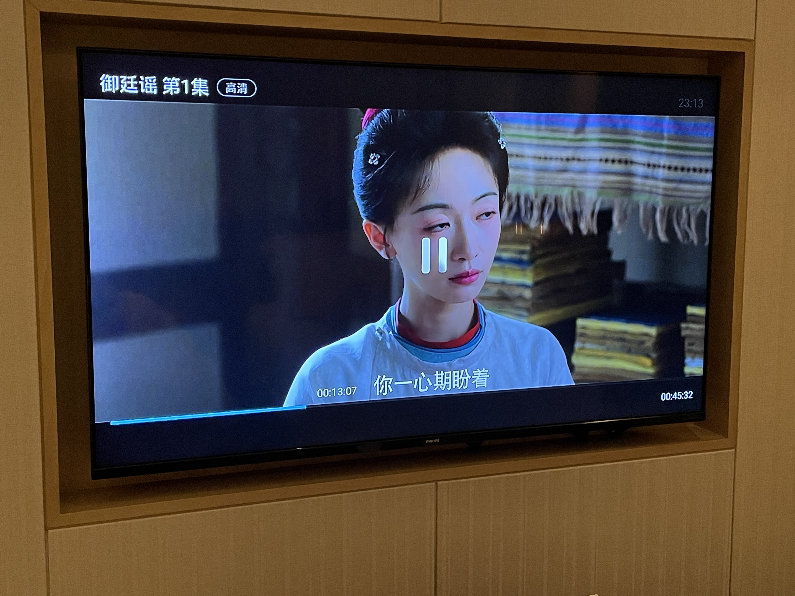
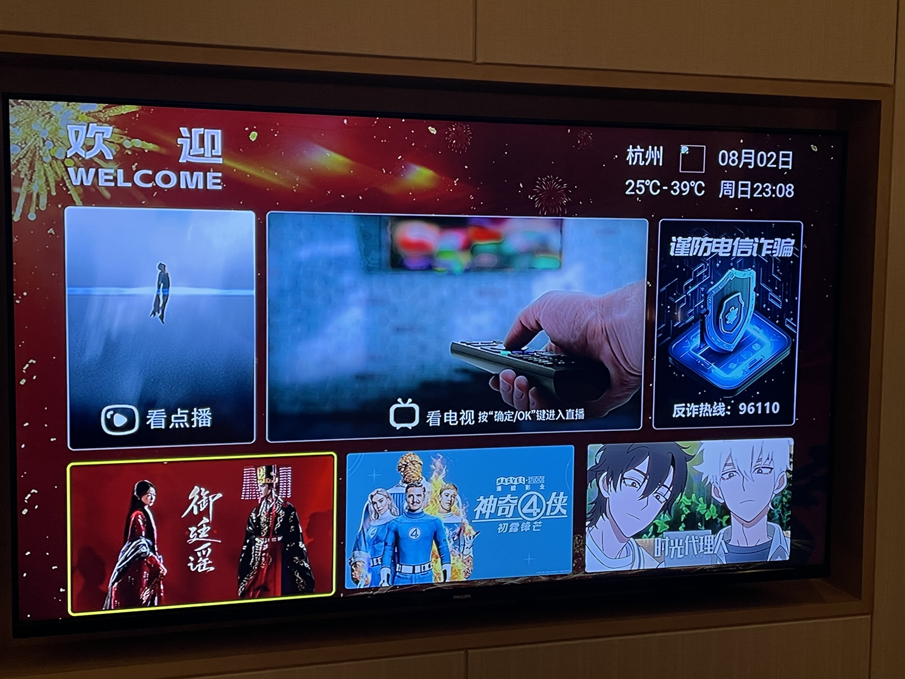
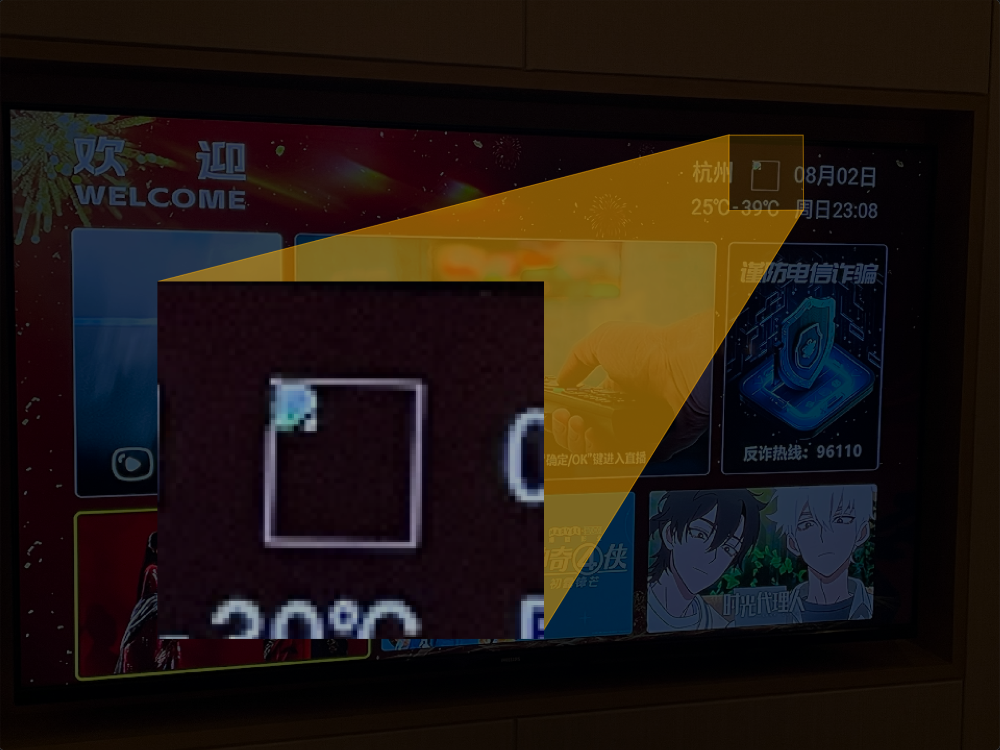
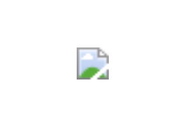

---
layout: center
transition: fade
---

---
layout: center
transition: fade
---

    

---
layout: center
clicks: 1
transition: slide-up
---

    

        兄弟以為他是正常的
        

            <Emoji emoji="😭" class="size-8" />
            <Emoji emoji="😭" class="size-8" />
            <Emoji emoji="😭" class="size-8" />
        

    

---
layout: center
---

# 幹嘛學網頁設計？

---
layout: center
---

# 可以學拆解！

    <a 
        href="https://homepage.ntu.edu.tw/~anatomy/Default.html"
        target="_blank"
        class="!border-none !opacity-50 !hover:brightness-50 !hover:text-white
               flex flex-row items-center gap-1"
    >
        國立臺灣大學醫學院解剖學暨細胞生物學科研究所
        <carbon:launch size="3" />
    </a>

