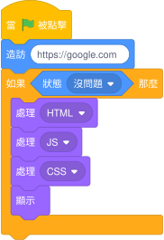
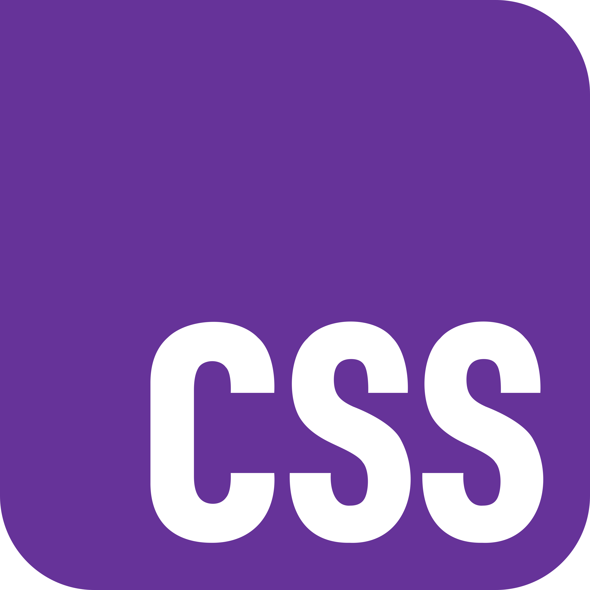
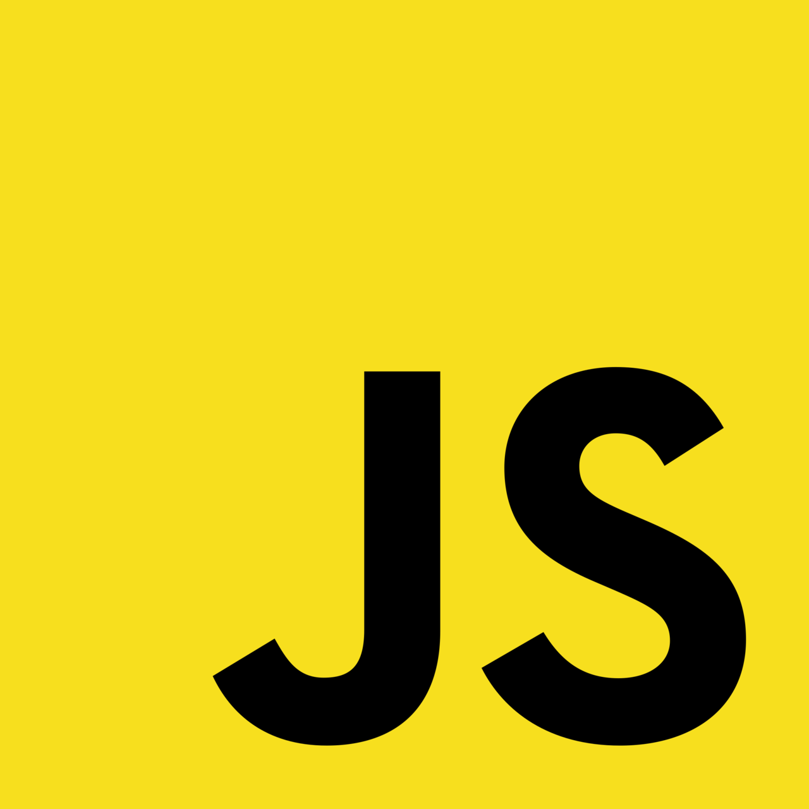
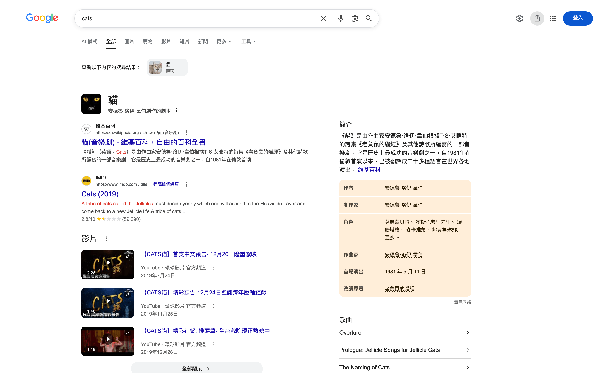
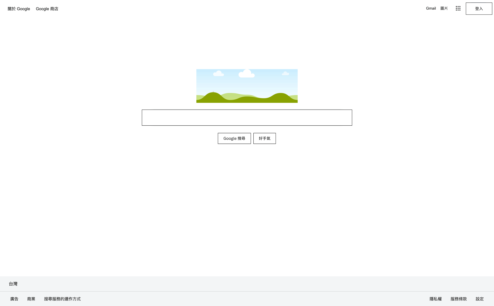
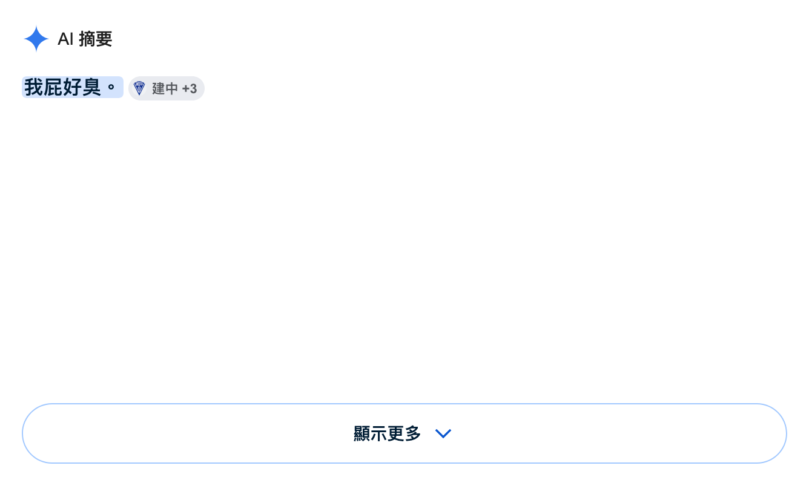

# 網站哪來的？
造訪網站時經過<b>伺服器處理</b>，到了你的<b>瀏覽器</b>的時候，如果沒有問題就可以被你看見。


<div class="icons mt-30" :class="{ 'is-disabled': $clicks > 0 }">
    <div class="flex flex-row items-center justify-center gap-4 text-8xl">
        <lucide-laptop />
        <lucide-arrow-right />
        <lucide-globe />
        <lucide-arrow-right />
        <lucide-app-window />
    </div>
</div>

<div class="flex flex-row items-center gap-16 blocks flex flex-col justify-center" :class="{ 'is-active': $clicks > 0 }">
    
</div>

<style>
.icons, .blocks {
    transition: all 400ms ease;
}

.icons {
    opacity: 100%;
}

.blocks {
    opacity: 0%;
    transform: translateY(0px);
}

.icons.is-disabled {
    opacity: 50%;
    filter: blur(20px);
}

.blocks.is-active {
    opacity: 100%;
    transform: translateY(-160px);
}
</style>

---
class: bg-orange-50 dark:bg-black
transition: slide-up
---

# 瀏覽器怎麼知道網站長怎樣？


<div class="flex flex-row gap-10 items-center justify-center mt-30">
    <div class="flex flex-col items-center gap-2">
        
        <h3 class="!m-0" v-click>HTML</h3>
        <p class="!m-0 text-center" v-click>網站內容怎樣主要他管的<br />網站的骨架</p>
    </div>
    <div class="flex flex-col items-center gap-2">
        
        <h3 class="!m-0" v-click>CSS</h3>
        <p class="!m-0 text-center" v-click>網站好看都是他害的<br />大部分都挺直觀</p>
    </div>
    <div class="flex flex-col items-center gap-2">
        
        <h3 class="!m-0" v-click>JavaScript</h3>
        <p class="!m-0 text-center" v-click>世上最人性化的語言<br />讓網站變有用</p>
    </div>
</div>


---
class: bg-black/90 text-white/80
clicks: 4
transition: fade
---

<div class="text-center">
<p>以咕嚕咕嚕網站為例</p>
</div>

<div class="absolute top-0 bottom-0 mt-24">
    <p v-click="1">我們可以一個一個拆開來看：</p>
    <ul>
        <li v-click="2"><b>第一層：</b>HTML – 整個網頁的骨架</li>
        <li v-click="3"><b>第二層：</b>CSS – 把網頁弄得漂亮，就是你眼前所看到的網站</li>
        <li v-click="4"><b>第三層：</b>JavaScript – 讓網站真的可以做事</li>
    </ul>
</div>

<div class="w-full relative">
    <div class="absolute scene mt-4" :class="{ 'is-active': $clicks > 0 }">
        <Browser class="browser w-full text-black" :key="$clicks == 4" :url="$clicks == 4 ? 'https://google.com/search?q=cats' : 'https://google.com'">
            
            
        </Browser>
    </div>
    <!-- this shit is calculated. pleaes dont change -->
    <div class="absolute scene mt-18.5 naked" :class="{ 'is-active': $clicks == 2 }">
        
    </div>
</div>

<style>
.scene {
    perspective: 800px;
    perspective-origin: center center;
}

/* lmfao wtf */
.naked.browser {
    opacity: 0;
}

.scene.is-active .naked.browser {
    opacity: 0.8;
}

.browser, .naked.browser {
    transition: all 400ms ease;
    transform: none;
    transform-style: preserve-3d;
}

.naked.browser {
    transform: rotateX(50deg);
}

.scene.is-active .browser {
    transform: rotateX(50deg) translateY(100px);
}

.scene.is-active .naked.browser {
    transform: rotateX(50deg) translateY(-50px);
}
</style>

---
layout: center
---

# 從 HTML 開始！

---
layout: two-cols
transition: slide-up
---

<!-- 假設某間餐廳覺得薯餅加上漢堡，也就是澱粉加上澱粉，大家都喜歡吃，所以做了一個破網站推銷 -->

<p class="!p-0 !mt-0 !mb-0">來看一個澱粉加澱粉網站的原始碼：</p>

<div v-click="1">

```html [index.html] {all|all|all|1|3-8|3,8|4|5-7}
<!DOCTYPE html>
<html>
    <body>
        <h1>薯餅漢堡</h1>
        <p>
            鼠來寶今年樣樣好
        </p>
    </body>
</html>
```

</div>

<p v-click="2" class="!mb-0">你會發現其實除了某些看不懂的魔⬈術⬊技⬈巧⬊之外，都還蠻直觀的：</p>
<ul class="mt-2">
    <li v-click="3"><b><code>&lt;!DOCTYPE html&gt;</code>：</b>代表這是一個 HTML 文件</li>
    <li v-click="4"><b><code>&lt;標籤&gt;...&lt;&#47;標籤&gt;</code>：</b>整份文件基本上都是標籤和內容組成</li>
    <li v-click="5"><b><code>&lt;body&gt;...&lt;&#47;body&gt;</code>：</b>包夾的是可見網頁的骨架</li>
    <li v-click="6"><b><code>h1</code>~<code>h6</code>：</b>各種的標題，由大到小</li>
    <li v-click="7"><b><code>p</code>：</b>請輸入文本</li>
</ul>

::right::

<div class="ml-8 mt-10" v-click="1" :style="{ transition: 'all 200ms ease', opacity: $clicks == 3 ? 0.4 : 1 }">

<h1 class="font-bold" :style="{ transition: 'all 200ms ease', opacity: $clicks > 6 ? 0.4 : 1 }">薯餅漢堡</h1>
<p :style="{ transition: 'all 200ms ease', opacity: $clicks >= 6 && $clicks != 7 ? 0.4 : 1 }">鼠來寶今年樣樣好</p>

</div>

---
layout: center
transition: fade
---

# 來看看其他網站的架構！

<p class="text-center">像是 <a href="https://google.com/search?q=同建大中華" target="_blank">咕嚕咕嚕</a></p>

<p class="mt-8 text-center scale-200%" v-click="1"><kbd>Ctrl</kbd> <kbd>Shift</kbd> <kbd>I</kbd></p>

---
layout: center
transition: slide-up
---


---
layout: center
transition: fade
---



---

# 休息
