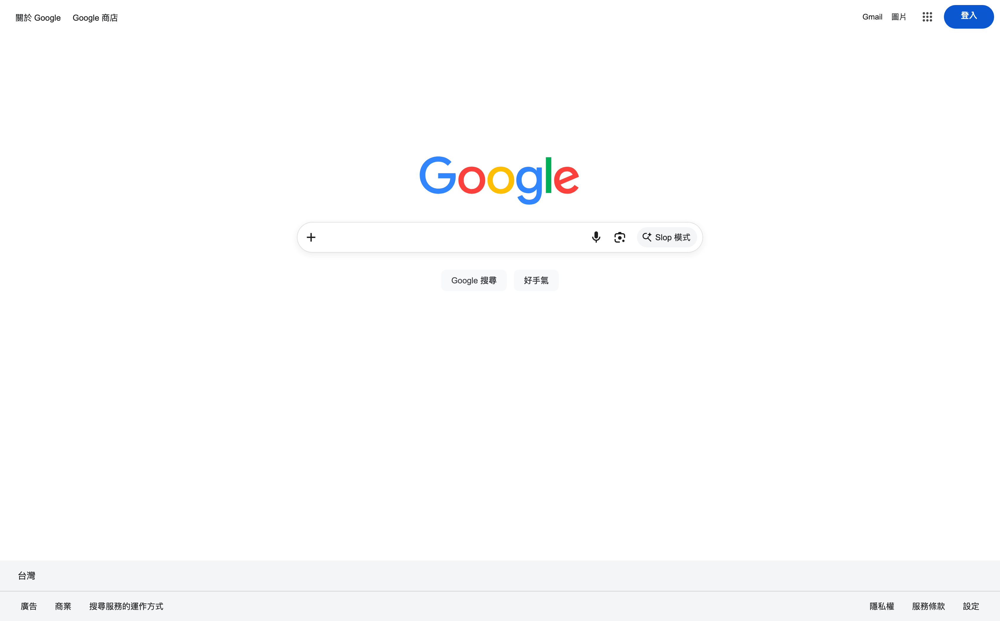

<h1>
    <span class="text-orange">H</span>
    <span>yper</span>
    <span class="text-orange">T</span>
    <span>ext&nbsp;</span>
    <span class="text-orange">M</span>
    <span>arkup&nbsp;</span>
    <span class="text-orange">L</span>
    <span>anguage</span>
</h1>

---
class: bg-black/90 text-white/80
layout: center
transition: slide-up
clicks: 1
---

<div class="flex flex-col items-center">

<h1 v-if="$clicks == 0">到底是不是程式語言？</h1>


</div>

---
class: bg-black/90 text-white/80
clicks: 4
transition: fade
---

<div class="text-center">
<p>來看看 Google</p>
</div>

<div class="absolute top-0 bottom-0 mt-24">
    <p v-click="1">我們可以一層一層拆開來看：</p>
    <ul>
        <li v-click="2"><b>第一層：</b>HTML – 整個網頁的骨架，最基礎的一層</li>
        <li v-click="3"><b>第二層：</b>CSS – 把網頁弄得漂亮，就是你眼前所看到的網站</li>
        <li v-click="4"><b>第三層：</b>JavaScript – 讓網站真的可以做事，像是搜尋建議、即時搜尋結果</li>
    </ul>
</div>

<div class="w-full relative">
    <div class="absolute scene mt-4" :class="{ 'is-active': $clicks > 0, 'is-dark': $clicks == 1 || $clicks == 2 }">
        <Browser
            class="browser w-full text-black"
            :key="$clicks == 4"
            :url="$clicks == 4 ? 'google.com/search?q=cats' : 'google.com'">
            
            
        </Browser>
    </div>
    <!-- this shit is calculated. pleaes dont change -->
    <div class="absolute scene mt-18.5 naked" :class="{ 'is-active': $clicks == 2 }">
        
    </div>
    <!-- PREFETCH ONLY -->
    <div class="absolute scene mt-18.5 naked" :class="{ 'is-active': false }">
        
    </div>
    <!-- PREFETCH ONLY -->
    <div class="absolute scene mt-18.5 naked" :class="{ 'is-active': false }">
        
    </div>
</div>

<style>
.scene {
    perspective: 800px;
    perspective-origin: center center;
}

/* lmfao wtf */
.naked.browser {
    opacity: 0;
}

.scene.is-active .naked.browser {
    opacity: 0.8;
}

.browser, .naked.browser {
    transition: all 400ms ease;
    transform: none;
    transform-style: preserve-3d;
}

.naked.browser {
    transform: rotateX(50deg);
}

.scene.is-active .browser {
    transform: rotateX(50deg) translateY(100px);
}

.scene.is-dark .browser {
    opacity: 50%;
}

.scene.is-active .naked.browser {
    transform: rotateX(50deg) translateY(-50px);
}
</style>

---
class: bg-black/90 text-white/80
transition: slide-up
---

<div v-click="5" class="text-center !text-8xl mt-4">元素</div>

<div class="absolute inset-0 flex items-center justify-center">
    <pre class="text-8xl flex">
        <span>&lt;</span>
        <span v-click="1" class="text-blue">div</span>
        <span v-click="2">&gt;</span>
        <span v-click="3" class="opacity-80%">...</span>
        <span v-click="4">&lt;&#47;</span>
        <span v-click="4" class="text-orange">div</span>
        <span v-click="4">&gt;</span>
    </pre>
</div>

<div class="absolute inset-0 flex flex-col items-center justify-center mt-60">
    <v-switch class="text-center">
      <template #0>
          <div class="opacity-0%">69420</div>
          <div class="text-6xl">開始</div>
      </template>
      <template #1>
          <div class="opacity-0%">69420</div>
          <div class="text-6xl">標籤名稱</div>
      </template>
      <template #2>
          <div class="opacity-0%">69420</div>
          <div class="text-6xl">標籤已開啟</div>
      </template>
      <template #3>
          <div class="opacity-60%">標籤已開啟</div>
          <div class="text-6xl">文字或元素</div>
      </template>
      <template #4>
          <div class="opacity-0%">標籤已開啟</div>
          <div class="text-6xl">標籤已閉合</div>
      </template>
      <template #5>
      </template>
    </v-switch>
</div>

---
class: bg-black/90 text-white/80
transition: fade
---

<div v-click="1" class="text-center !text-8xl mt-4">屬性</div>

<div class="absolute inset-0 flex items-center justify-center">
    <pre class="text-6xl flex">
        <span v-click.hide="1">&lt;abc&nbsp;</span>
        <span class="text-blue transition-all duration-200" :style="{ opacity: $clicks >= 3 ? 0.3 : 1 }">xyz</span>
        <span class="transition-all duration-200" :style="{ opacity: $clicks >= 3 ? 0.3 : 1 }">&#61;</span>
        <span class="text-orange transition-all duration-200" :style="{ opacity: $clicks >= 3 ? 0.3 : 1 }">"123"</span>
        <span>&nbsp;</span>
        <span class="text-blue transition-all duration-200" :style="{ opacity: $clicks == 2 ? 0.3 : 1 }">ghi</span>
        <span v-click.hide="1">&gt;&lt;&#47;abc&gt;</span>
    </pre>
</div>

<div class="absolute inset-0 flex items-center justify-center mt-60">
    <ul>
        <li v-click="2">關於「xyz」的資料為 <code class="!bg-transparent border-solid border-1 border-white/10">"123"</code></li>
        <li v-click="3">
            關於「ghi」的資料為 <code class="!bg-transparent border-solid border-1 border-white/10">""</code><br />
            <span v-click="4">...語意上，就是「true」</span>
        </li>
    </ul>
</div>

---
layout: two-cols
transition: slide-up
---

<p class="!p-0 !mt-0 !mb-0">來看一個網站的原始碼：</p>

<div v-click="1">

```html [index.html] {all|all|1|3-7|4|5|6}
<!DOCTYPE html>
<html>
    <body>
        <h1>薯餅漢堡</h1>
        <p>鼠來寶今年樣樣好</p>
        
    </body>
</html>
```

</div>

<p v-click="1" class="!mb-0">你會發現其實除了某些看不懂的魔術技巧之外：</p>
<ul class="mt-2">
    <li v-click="2"><b><code>&lt;!DOCTYPE html&gt;</code>：</b>代表這是一個 HTML 文件</li>
    <li v-click="3"><b><code>&lt;body&gt;...&lt;&#47;body&gt;</code>：</b>包夾的是可見網頁的骨架</li>
    <li v-click="4"><b><code>h1</code>~<code>h6</code>：</b>各種的標題元素，由大到小</li>
    <li v-click="5"><b><code>p</code>：</b>請輸入文本</li>
    <li v-click="6"><b><code>img</code>：</b>利用 <code>img</code> 標籤 + <code>src</code> 屬性放圖片連結</li>
</ul>

::right::

<div class="ml-8 mt-9" v-click="1" :style="{ transition: 'all 200ms ease', opacity: $clicks == 2 ? 0.4 : 1 }">

<h1 class="font-bold !text-6xl" :style="{ transition: 'all 200ms ease', opacity: $clicks > 4 ? 0.4 : 1 }">薯餅漢堡</h1>
<p :style="{ transition: 'all 200ms ease', opacity: $clicks >= 4 && $clicks != 5 ? 0.4 : 1 }">鼠來寶今年樣樣好</p>
= 4 && $clicks != 6 ? 0.4 : 1 }" />

</div>

---
layout: center
transition: fade
---

# 來看看別人網站的架構！

<p class="text-center">
    像是<a href="google.com/search?q=同建大中華" target="_blank">咕嚕咕嚕</a>，我們可以用開發者工具看他的程式碼
</p>

<p class="mt-40 text-center" v-click="1">
    <kbd>Ctrl</kbd> + <kbd>Shift</kbd> + <kbd>I</kbd>
    <br /><br />或是<br /><br />
    <kbd>F12</kbd>
</p>

---
layout: center
transition: slide-up
---


---
layout: center
transition: slide-up
---

# 寫一個網站
在本地創建一個 `index.html` 檔案，開啟編輯器就可以了！

---
layout: default
transition: slide-up
---

<code>index.html</code>

```html {monaco-run}
<!DOCTYPE html>
<html>
  <head>
    <meta charset="UTF-8" />
  </head>
  <body>
    <!--

        Placeholder

    -->
  </body>
</html>
```

---
transition: slide-up
---

<div class="absolute inset-0 flex items-center justify-center p-20">
    <Browser class="w-120 text-black" url="localhost:3000">
        <div class="p-4">
            <h1 class="font-[serif] !m-0 dark:text-white/80">我的網站</h1>
            
        </div>
    </Browser>
</div>

---
layout: center
transition: fade
---

# 實作！

1. 用 `h1` ~ `h3` 下幾個<s>台灣媒體</s>標題
2. 用多個 `p` 元素寫你怎麼跟外星人溝通
3. 放幾張照片，試試看 ``
4. 用一個 `div` 包住這些內容（巢狀結構）
5. 用開發者工具偷看別人網站都藏些什麼

---
layout: center
transition: fade
---

<div class="text-6xl flex flex-row items-center gap-4">
    <span>來點</span>
    
    <span>？</span>
</div>

---
layout: center
transition: slide-left
class: bg-black/90 text-white/80
---

# 休息

<Next />
