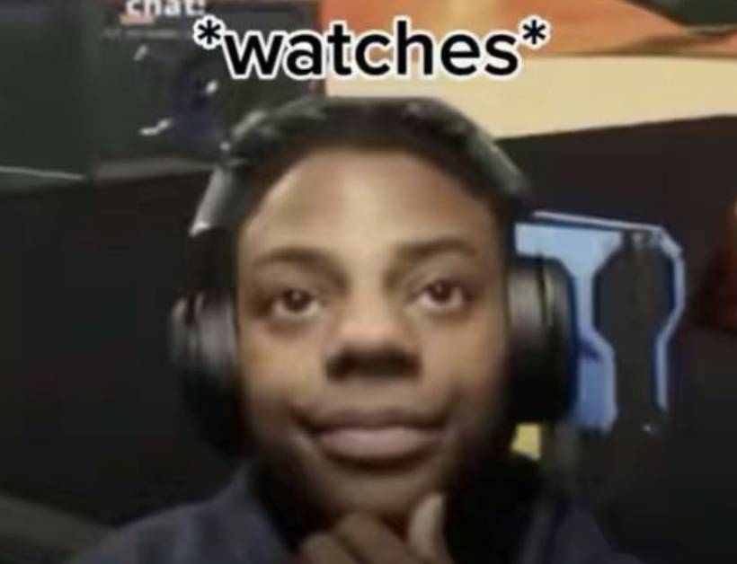

<h1>
    <span class="text-purple">C</span>
    <span>ascading&nbsp;</span>
    <span class="text-purple">S</span>
    <span>tyle&nbsp;</span>
    <span class="text-purple">S</span>
    <span>heets</span>
</h1>

---
class: bg-black/90 text-white/80
layout: center
transition: slide-up
clicks: 1
---

<div class="flex flex-col items-center">


<h1 v-if="$clicks == 0">到底是不是程式語言？</h1>
<h1 v-if="$clicks == 1">你可以用 CSS 做出 x86_16 CPU</h1>




<h2 v-if="$clicks == 1" class="mt-5">有人說是 "declaration language"</h2>

<!-- preload -->


</div>

---
class: bg-black/90 text-white/80
layout: center
transition: slide-up
---

<div class="absolute inset-0 flex items-center justify-center">
    <pre class="text-6xl flex flex-col gap-4">
        <div class="flex">
            <span class="text-blue">button&nbsp;</span>
            <span v-click="1" class="opacity-80%">{</span>
        </div>
        <div class="flex">
            <span v-click="2" class="text-orange">&nbsp;&nbsp;color</span>
            <span v-click="2" class="opacity-80%">:&nbsp;</span>
            <span v-click="2" class="text-red">red</span>
            <span v-click="2" class="opacity-80%">;</span>
        </div>
        <span v-click="3" class="opacity-80%">}</span>
    </pre>
</div>

<div class="absolute inset-0 flex flex-col items-center justify-center mt-80">
    <v-switch class="text-center">
      <template #0>
          <div class="text-6xl">選擇器</div>
      </template>
      <template #1></template>
      <template #2>
          <div class="text-6xl">屬性: 值;</div>
      </template>
    </v-switch>
</div>

---
layout: two-cols
transition: slide-up
---

`index.html`

```html
<div class="page">
    <button>Click Me!</button>
</div>
<button>Wow!</button>
```

<br />
<hr />
<br />

`style.css`

```css{none|1-3|1-7|all}
.page {
    text-align: center;
}

button {
    font-size: 24px;
}

.page button {
    color: red;
}
```

::right::

<div class="ml-8 mt-4">
    <div v-if="$clicks == 0">
        <Browser url="localhost:3000">
            <div class="p-2">
                <div>
                    <Button class="font-[serif] bg-gray-200 !p-0.5 !py-0 text-xs !rounded-sm !cursor-default">Click Me!</Button>
                </div>
                <Button class="font-[serif] bg-gray-200 !p-0.5 !py-0 text-xs !rounded-sm !cursor-default">Wow!</Button>
            </div>
        </Browser>
        <div class="abs-br m-14">
            <h1>初始狀態</h1>
        </div>
    </div>
    <div v-if="$clicks == 1">
        <Browser url="localhost:3000">
            <div class="p-2">
                <div class="text-center">
                    <Button class="font-[serif] bg-gray-200 !p-0.5 !py-0 text-xs !rounded-sm !cursor-default">Click Me!</Button>
                </div>
                <Button class="font-[serif] bg-gray-200 !p-0.5 !py-0 text-xs !rounded-sm !cursor-default">Wow!</Button>
            </div>
        </Browser>
        <div class="abs-br m-14">
            <h1>有 page 類別的元素</h1>
        </div>
    </div>
    <div v-if="$clicks == 2">
        <Browser url="localhost:3000">
            <div class="p-2">
                <div class="text-center">
                    <Button class="font-[serif] bg-gray-200 !p-0.5 !py-2 text-xs !rounded-sm !cursor-default font-size-[24px]">Click Me!</Button>
                </div>
                <Button class="font-[serif] bg-gray-200 !p-0.5 !py-2 text-xs !rounded-sm !cursor-default font-size-[24px]">Wow!</Button>
            </div>
        </Browser>
        <div class="abs-br m-14">
            <h1>+ 所有按鈕元素</h1>
        </div>
    </div>
    <div v-if="$clicks == 3">
        <Browser url="localhost:3000">
            <div class="p-2">
                <div class="text-center">
                    <Button class="font-[serif] bg-gray-200 !p-0.5 !py-2 text-xs !rounded-sm !cursor-default font-size-[24px] text-[red]">
                        Click Me!
                    </Button>
                </div>
                <Button class="font-[serif] bg-gray-200 !p-0.5 !py-2 text-xs !rounded-sm !cursor-default font-size-[24px]">
                    Wow!
                </Button>
            </div>
        </Browser>
        <div class="abs-br m-14 text-right">
            <h1>+ 在 page 類別元素中<br />的按鈕</h1>
        </div>
    </div>
</div>

---
layout: center
transition: slide-up
---

# 繼續寫一個網站
在本地創建一個 `style.css` 檔案，然後嵌入 `index.html`：

<div class="text-left">

```html
<!-- ... -->

<head>
  <!-- ... -->
  <link rel="stylesheet" href="/style.css">
</head>

<!-- ... -->
```

</div>

---
transition: slide-up
---

<div class="absolute inset-0 flex items-center justify-center p-20">
    <Browser class="w-120 text-black" url="localhost:3000">
        <div class="p-4">
            <h1 class="font-[serif] !m-0 text-red text-center">我的網站</h1>
            
        </div>
    </Browser>
</div>

---
layout: center
transition: fade
---

# 實作！
1. 用元素選擇器把所有 `body` 的文字顏色、背景顏色改掉
2. 幫一些元素加入 `class="..."` 定義類別，用類別選擇顏色或大小
3. 一個元素想要有多個 class 怎麼辦？
4. 怎麼用選擇器指定多個 class 條件？

<Next />
