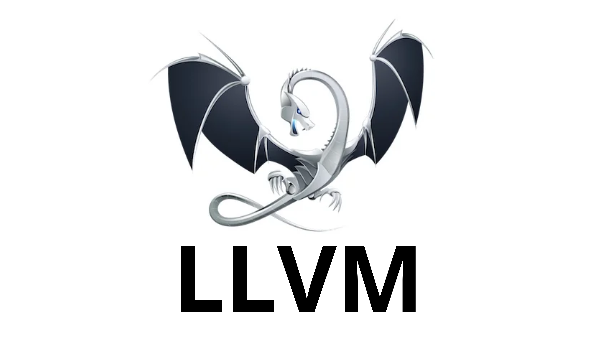

<h1>
    <span class="text-yellow">J</span>
    <span>ava</span>
    <span class="text-yellow">S</span>
    <span>cript</span>
</h1>

---
class: bg-black/90 text-white/80
layout: center
transition: slide-up
clicks: 1
---

<div class="flex flex-col items-center">

<h1 v-if="$clicks == 0">老樣子，到底是不是程式語言？</h1>


</div>

---
class: bg-black/90 text-white/80
transition: slide-up
colorSchema: dark
---

# 宣告

<div class="absolute inset-0 flex items-center justify-center">
    <pre class="text-6xl flex gap-4">
        <span class="text-blue" v-click="1">let&nbsp;</span>
        <span class="text-orange" v-click="2">const&nbsp;</span>
        <span class="text-red opacity-60% line-through" v-click="3">var</span>
    </pre>
</div>

<div class="absolute inset-0 flex flex-col items-center justify-center mt-80">
    <v-switch class="text-center">
      <template #1>
          <span class="text-4xl">宣告一個變數</span>
      </template>
      <template #2>
          <span class="text-4xl">宣告一個<b>不可替換</b>變數</span>
      </template>
      <template #3>
          <span class="text-4xl opacity-60%">早期宣告方式，不建議</span>
      </template>
    </v-switch>
</div>

---
class: bg-black/90 text-white/80
transition: slide-up
colorSchema: dark
clicks: 1
---

# 分號戰爭

<div class="absolute inset-0 flex flex-col items-center justify-center gap-4">
    
    <h1 v-if="$clicks == 1">不用</h1>
</div>

---
class: bg-black/90 text-white/80
transition: slide-up
colorSchema: dark
---

# 輸出結果

<div class="absolute inset-0 flex items-center justify-center">
    <pre class="text-4xl flex">
        <span>console</span>
        <span class="opacity-60%" v-click="1">.</span>
        <span class="text-blue" v-click="1">log</span>
        <span class="opacity-60%" v-click="1">(</span>
        <span class="text-orange" v-click="2">"Hello, World!"</span>
        <span class="opacity-60%" v-click="3">)</span>
        <span class="opacity-60%" v-click="4">;</span>
    </pre>
</div>

<div class="absolute inset-0 flex items-center justify-center opacity-30%">
    
</div>

---
class: bg-black/90 text-white/80
transition: slide-up
colorSchema: dark
---

# 跳訊息
你們到底在躲什麼啦？我限動不是轉發很多你們拍的 "我超愛聖結石 聖結石我偶像 我Bang" 的影片嗎？躲屁啊 就跟過去那些年我的聖粉一樣，躲得非常好 躲到我差點以為你們真的都消失了 躲貓貓大師啊 生怕被我抓到啊？

<div class="absolute inset-0 flex items-center justify-center opacity-5%">
    
</div>

<div class="absolute inset-0 flex flex-col items-center justify-center gap-4">
    <pre class="text-4xl flex">
        <span>window</span>
        <span class="opacity-60%" v-click="1">.</span>
        <span class="text-blue" v-click="1">alert</span>
        <span class="opacity-60%" v-click="1">(</span>
        <span class="text-orange" v-click="2">"我 BANG!"</span>
        <span class="opacity-60%" v-click="3">)</span>
        <span class="opacity-60%" v-click="4">;</span>
    </pre>
    <Button v-click="5" onclick="javascript:alert('我 BANG!')">按我！</Button>
</div>


---
transition: slide-up
monacoRunUseStrict: false
---

<div class="flex flex-row items-center gap-4 mb-10">
    <Tab label="宣告" clicks="0" />
    <Tab label="資料型別" clicks="1" />
    <Tab label="console" clicks="2" />
    <Tab label="運算子" clicks="3" />
    <Tab label="選擇結構" clicks="4" />
    <Tab label="for" clicks="5" />
    <Tab label="while" clicks="6" />
    <Tab label="函式" clicks="7" />
</div>


<v-switch>
<template #0>

```js {monaco-run}{autorun:false}
let pizza = 0;
pizza = pizza + 1;
pizza = pizza * 100;

// pizza 現在是 100
console.log(pizza);

// 宣告一個不會替換掉的數字
const zero = 0;

// 這會出錯：
zero = zero + 1;
//   ^ TypeError: Assignment to constant variable.
```

</template>

<template #1>

```js
let str = "CKEFGISC";
str = "Hello " + str;
str // "Hello CKEFGISC"

let pie = -3.1469420;
pie -= 100;
pie // -103.146942

const yes = true;
const naw = false;

const list = ["a", "b"];
list.push("o");
list.length // 3
list        // ["a", "b", "o"]

const scores = { "charlie": 80, "walter": 99.1 };
scores.charlie     // 80
scores["walter"]   // 99.1
```

</template>

<template #2>

```js {monaco-run}{autorun:false}
const name = "you";
const cash = 1000;

console.log(name, "owe me", cash);
```

<a href="about:blank" target="_blank">about:blank</a>

</template>

<template #3>

```js {monaco-run}{autorun:false}
const name = "Charles";
console.log(name == "Charles");

let cash = 0;
cash += 100;
console.log(!(cash >= 100));

const a = 100;
console.log(a ==  "100");  // ?
console.log(a === "100");  // ?
```

</template>

<template #4>

```js {monaco-run}{autorun:false}
const recipe = "可樂加玉米濃湯";

if (recipe == "高麗菜煮蛋") {
  console.log("坐你那一桌");
} else if (recipe == "可樂加玉米濃湯") {
  console.log("去坐高麗菜煮蛋那桌");
} else {
  console.log("好吃！");
}
```

</template>

<template #5>

```js {monaco-run}{autorun:false}
// 輸出 3 次
const times = 3;

console.log("來杯好茶");
for (let i = 0; i < times; i++) {
  console.log("搖一搖");
}
```

</template>

<template #6>

```js {monaco-run}{autorun:false}
let mangoJump = 7;

while (mangoJump > 0) {
    console.log("我喜歡你");
    mangoJump--;
}
```

</template>

<template #7>

```js {monaco-run}{autorun:false}
function add(a, b) {
  return a + b;
}

console.log(add(6 * 9, 6 + 9));
console.log(add("Hello ", "World"));
```

</template>

</v-switch>

---
layout: center
transition: slide-up
---

# HTML + JavaScript?

---
layout: two-cols
transition: slide-up
---

`index.html`

```html
<button>Wowie</button>
<button>Zowie</button>
```

<br />
<hr />
<br />

`index.js`

```js{none|1|3-5|7|all}
const button = document.querySelector("button");

function onClick() {
    window.alert("我BANG！");
}

button.addEventListener("click", onClick);
```

::right::

<div class="ml-8 mt-4">
    <div v-if="$clicks == 0">
        <Browser url="localhost:3000">
            <div class="p-2">
                <Button class="font-[serif] bg-gray-200 !p-0.5 !py-0 text-xs !rounded-sm !cursor-default">Wowie</Button>
                <Button class="font-[serif] bg-gray-200 !p-0.5 !py-0 text-xs !rounded-sm !cursor-default">Zowie</Button>
            </div>
        </Browser>
        <div class="abs-br m-14">
            <h1>兩顆按鈕</h1>
        </div>
    </div>
    <div v-if="$clicks > 0 && $clicks < 4">
        <Browser url="localhost:3000">
            <div class="p-2">
                <Button class="font-[serif] bg-gray-200 !p-0.5 !py-0 text-xs !rounded-sm !cursor-default ring-2">Wowie</Button>
                <Button class="font-[serif] bg-gray-200 !p-0.5 !py-0 text-xs !rounded-sm !cursor-default opacity-30%">Zowie</Button>
            </div>
        </Browser>
        <div class="abs-br m-14">
            <h1 v-if="$clicks == 1">選取第一個按鈕元素</h1>
            <h1 v-if="$clicks == 2">寫一個函式處理點擊事件</h1>
            <h1 v-if="$clicks == 3">註冊這個事件</h1>
        </div>
    </div>
    <div v-if="$clicks == 4">
        <Browser url="localhost:3000">
            <div class="p-2">
                <Button class="font-[serif] bg-gray-200 !p-0.5 !py-0 text-xs !rounded-sm !cursor-default" onclick="alert('我BANG！')">Wowie</Button>
                <Button class="font-[serif] bg-gray-200 !p-0.5 !py-0 text-xs !rounded-sm !cursor-default">Zowie</Button>
            </div>
        </Browser>
        <div class="abs-br m-14">
            <h1>完成！</h1>
        </div>
    </div>
</div>

---
layout: center
transition: slide-up
---

# 代入消去法
在本地創建一個 `app.js` 檔案，然後嵌入 `index.html`：

<div class="text-left">

```html
<!-- ... -->

<body>
  <!-- ... -->
  <script type="text/javascript" src="/app.js"></script>
</body>

<!-- ... -->
```

</div>
