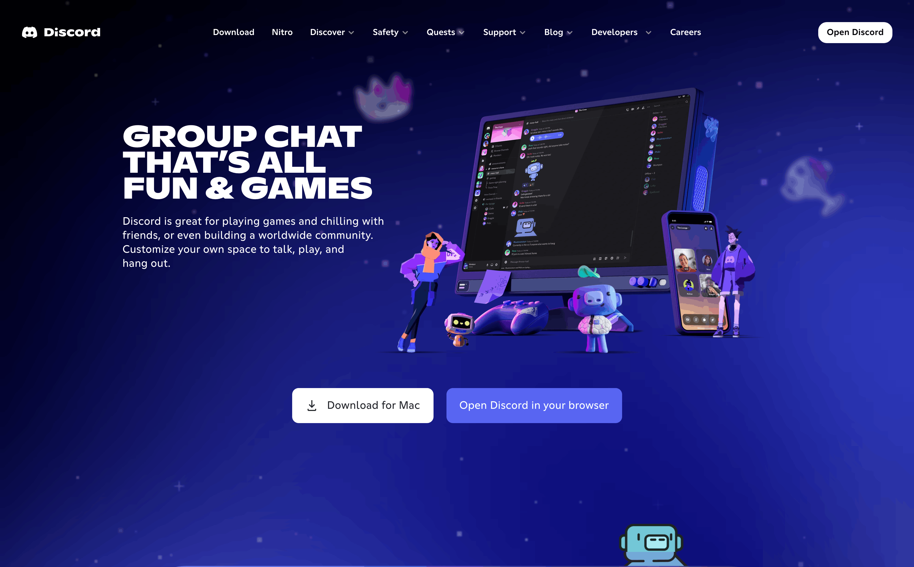
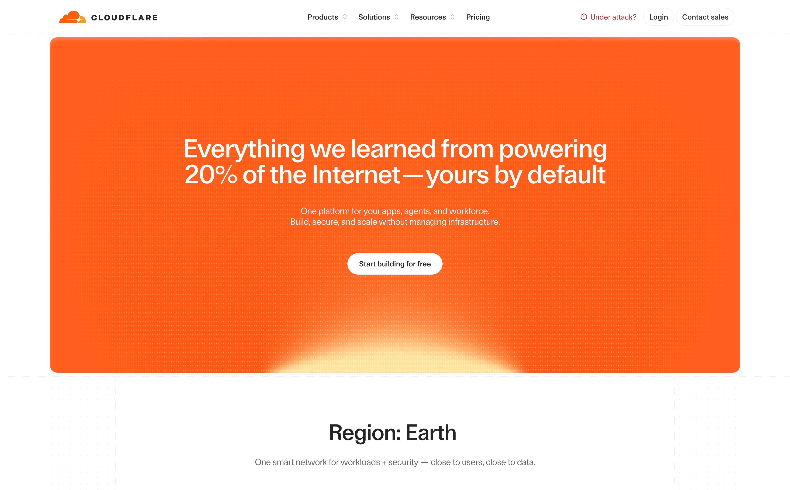

# 網頁設計
講話人類：awd

  <a 
      href="https://github.com/AWeirdDev/course"
      target="_blank"
      class="!border-none !opacity-50 !hover:brightness-50 !hover:text-white
             flex flex-row items-center gap-1
      "
  >
    <carbon:logo-github />
    簡報也在 GitHub 上
  </a>

    

    

    

---
src: ./pages/1-whoami.md
hide: false
---

---
src: ./pages/2-whats-a-website.md
hide: false
---

---
src: ./pages/3-html.md
hide: false
---

---
src: ./pages/4-css.md
hide: false
---

---
src: ./pages/5-js.md
hide: false
---

---
src: ./pages/6-bigshit.md
hide: false
---

---
layout: center
class: text-center
---

# 掰掰，掰掰

[GitHub](https://github.com/AWeirdDev) · [開源](https://github.com/AWeirdDev/course)
